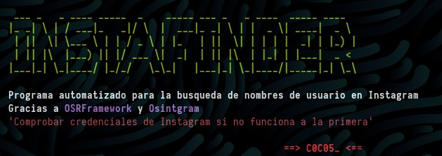

## En este post presento mi nueva herramienta basada en OsintFramework y Osintgram:

Está herramienta se encarga de generar una lista de usuarios disponibles gracias a los datos que insertes en el script:

 - Nombre: 
 - Apellido1:
 - Apellido2:
 - Año:
 - Ciudad:
 - Pais:

Esta generación de nombres de usuarios es gracias a el aplicativo de `alias_generator`

Después utiliza está lista para buscar en la api de **instagram** todos los usuarios que se encuentran disponibles en la plataforma, todo gracias al aplicativo `Osintgram` 
